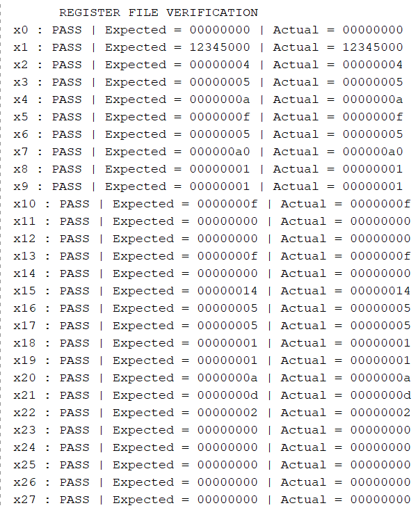
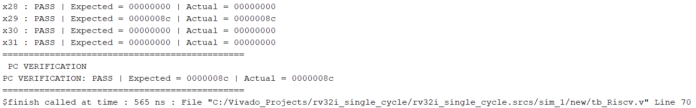
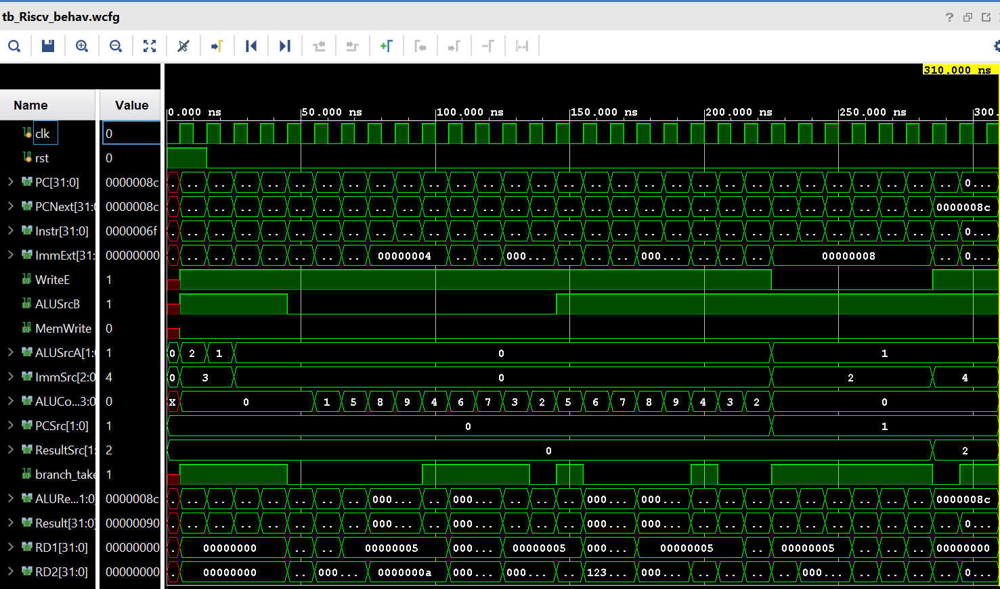

# RV32I Single-Cycle Processor

A complete, 32-bit single-cycle processor implementing the RISC-V RV32I Base Integer Instruction Set Architecture. Designed purely in Verilog HDL, this project focuses on a modular, synthesizable datapath with custom architectural enhancements for optimized execution.

---

## 📌 Overview

This processor is capable of fetching, decoding, and executing RV32I instructions in a single clock cycle. The design takes foundational inspiration from *Digital Design and Computer Architecture, RISC-V Edition* by Sarah & David Harris, but introduces several critical architectural deviations to streamline the datapath and isolate operational domains (such as branch comparisons and load extensions).

## 📊 Processor Statistics

| Metric | Detail |
|--------|--------|
| **Architecture** | Single-Cycle Harvard-Style Datapath |
| **ISA** | RV32I Base Integer (37 Instructions) |
| **Language** | Verilog HDL (Pure RTL) |
| **Total Modules** | 14 Custom RTL Modules |
| **Simulator** | Xilinx Vivado 2022.2 |
| **Instruction Memory** | 1024 × 32-bit (Initialized via `.mem`) |
| **Data Memory** | 1024 × 32-bit (Combinational Read, Synchronous Write) |
| **Register File** | 32 × 32-bit (Asynchronous Read, Synchronous Write) |

--- 

## 🚀 Architectural Enhancements

While standard textbook designs route almost all computations through the ALU, this processor introduces industry-aligned modifications to improve modularity and datapath clarity:

1. **Dedicated Branch Comparator**: Unlike conventional designs that use the main ALU for branch evaluation, this processor implements a standalone `Branch_comp` module. The ALU handles arithmetic, address generation, and logical operations, while the comparator strictly evaluates `BEQ`, `BNE`, `BLT`, `BGE`, `BLTU`, and `BGEU`.
2. **Load Extension Unit**: A dedicated combinational block (`Load_extend`) extracts and sign/zero-extends byte and halfword data directly from Data Memory before write-back, rather than mixing this logic into the main datapath.
3. **3-to-1 ALU Source A Multiplexer**: Expanded from a standard 2-to-1 mux to cleanly support `PC` routing for `AUIPC` and `JAL` target calculations, alongside standard Register and Zero inputs.
4. **Hardwired Reset State**: 
   - `PC` initializes directly to `0x00000000`.
   - `x0` register is strictly hardwired to `0`, ignoring any write attempts to maintain ISA compliance.
5. **RTL Parameterization & Scope Management**: To maintain clean and scalable code, all shared hardware encodings (Opcodes, ALU operations, Mux selects, etc.) are centralized as ``` `define ``` macros in a global header file (`defines.vh`).

## 🏗️ Processor Datapath
```text
     ## 🏗️ Processor Datapath

```text
    [PCNext] <-----------------------------------------------------+
       |                                                           |
       v                                                           |
   +-------+           +------------------+                        |
   |  PC   |---------->| Instruction Mem  |                        |
   +-------+           +------------------+                        |
       |                         |                                 |
       +-----------+             v (Instr)                         |
       |           |   +-------------------+      (Branch_Taken)   |
       v           |   |   Control Unit    |<------------------+   |
  +---------+      |   +-------------------+                   |   |
  | PCPlus4 |      |             |                             |   |
  +---------+      |             v (Control Signals)           |   |
       |           |   +-------------------+                   |   |
       v           |   |                   |                   |   |
   (PC+4 Bus)      |   v                   v                   |   |
       |           | +----------------+ +------------------+   |   |
       |           | | Register File  | | ImmSignExtend    |   |   |
       |           | +----------------+ +------------------+   |   |
       |           |   | (RD1)  | (RD2)         | (ImmExt)     |   |
       |           |   v        v               v              |   |
       |           | +---------------+  +---------------+      |   |
       |           | | Branch_comp   |  | Operand Muxes |      |   |
       |           | +---------------+  +---------------+      |   |
       |           |         |                  |              |   |
       |           |         +------------------+--------------+   |
       |           |                            |                  |
       |           +----------------------------|-------+          |
       |                                        v       v (PC)     |
       |                                    +---------------+      |
       |                                    |      ALU      |      |
       |                                    +---------------+      |
       |                                        |                  |
       |                                        v (ALUResult)      |
       |                +-----------------------+----------+       |
       |                |                       |          |       |
       |                v                       v          v       |
       |        +----------------+      +-------------+ +-------------+
       |        |  Data Memory   |----->| Load_extend | |  PCNextMux  |
       |        +----------------+ (RD) +-------------+ +-------------+
       |                                        |              ^
       |                  +---------------------+              |
       |                  |                                    |
       +------------------|------------------------------------+
       |                  |
       |                  v
       |           +-------------+
       +---------->| ResultSrcMux|<--- (ImmExt)
                   +-------------+
                          |
                          v (WriteD / Result)
                  [To Register File]
```
---

## 📜 Supported Instructions (37 Total)

The processor supports all 37 primary instructions of the RV32I base ISA.

* **R-Type**: `ADD`, `SUB`, `SLL`, `SLT`, `SLTU`, `XOR`, `SRL`, `SRA`, `OR`, `AND`
* **I-Type (ALU)**: `ADDI`, `SLTI`, `SLTIU`, `XORI`, `ORI`, `ANDI`, `SLLI`, `SRLI`, `SRAI`
* **I-Type (Load)**: `LB`, `LH`, `LW`, `LBU`, `LHU`
* **S-Type (Store)**: `SB`, `SH`, `SW`
* **B-Type (Branch)**: `BEQ`, `BNE`, `BLT`, `BGE`, `BLTU`, `BGEU`
* **U-Type**: `LUI`, `AUIPC`
* **J-Type**: `JAL`, `JALR`

*(Note: `ECALL` and `EBREAK` environment instructions are omitted as they are not currently utilized in the testbenches).*

---

## 🧩 RTL Module Breakdown

| Module | Description |
|--------|-------------|
| **RV32I_SingleCycle_CPU** | Top-level integration module connecting the datapath and control unit. |
| **PC & PCPlus4** | Program Counter register and dedicated adder for calculating `PC + 4`. |
| **PCNextMux** | Determines next PC source (`PC+4`, `PCTarget` for branches/JAL, or `JALRTarget`). |
| **Instruction_Memory** | 1024-word memory block initialized with machine code (`initialise_hex.mem`). |
| **Register_File** | 32x32-bit registers. Asynchronous read, synchronous write. `x0` hardwired to `0`. |
| **ImmSignExtend** | Extracts and sign/zero-extends immediate values based on instruction type. |
| **Control_Unit** | Decodes `opcode`, `funct3`, and `funct7` to generate all mux and write-enable signals. |
| **Branch_comp** | Dedicated comparator evaluating branch conditions independently of the ALU. |
| **ALUSrcAMux** | 3x1 Mux selecting ALU Operand A (`RD1`, `PC`, or `32'b0`). |
| **ALUSrcBMux** | 2x1 Mux selecting ALU Operand B (`RD2` or `ImmExt`). |
| **ALU** | Performs 10 distinct operations. Responsible for all execution except branching. |
| **Data_Memory** | 1024-word combinational read / synchronous write data storage. |
| **Load_extend** | Combinational block handling byte/halfword extraction and sign extension. |
| **ResultSrcMux** | 4x1 Mux selecting final Register File write-back data (`ALUResult`, `LoadData`, `PC+4`, or `ImmExt`). |

---

### Verification Flow

1. **Assembly Compilation**: The assembly script is compiled into raw machine code (`initialize_hex.mem`) using RARS.
2. **Execution**: The testbench initializes the Instruction Memory with the machine code and drives the processor clock (`clk`).
3. **Automated State Validation**: After the program completes execution, the testbench automatically halts and systematically compares the internal state of all 32 hardware registers (`dut.u_Register_File.regmem`) against the RARS pre-compiled golden reference file (`Expected.mem`).
4. **Program Counter Assertion**: The testbench explicitly asserts that the final Program Counter (`PC`) halts at the expected termination address (`32'h0000008c`).

### Verification Evidence

The processor successfully passes all automated assertions in simulation. 

* **Terminal Output:** The testbench automatically prints a `PASS/FAIL` log for all 32 registers and the final PC. 
  * 
  * 
* **Waveform Analysis:** Single-cycle timing, control signal generation, and datapath routing were visually verified using Xilinx Vivado.
  * 

**Current Verification Status**:
- ✅ **ALU Operations** (Arithmetic, Logical, Shifts)
- ✅ **Load Operations** (Sign/Zero extensions)
- ✅ **Branching & Jumps** (Target calculations and Control flow)
- ✅ **Immediate Generation** (`LUI`, `AUIPC`)
- ✅ **32-Register State Validation** (Automated comparison)
- ✅ **Final PC State** (Automated assertion)
- ⚠️ *Note: Store instructions correctly calculate addresses and drive write-enable signals to the Data Memory, but automated validation of the final memory array against an expected dump is slated for the next update.*

---

## 📂 Repository Structure
```text
rv32i_single_cycle/
│
├── Docs/                      # Documentation and schematics
│   └── RTL_schematic.pdf
│
├── Images/                    # Verification visuals
│   ├── Result1.png
│   ├── Result2.png
│   └── Simulation.png
│
├── Include/                   # Global definitions and macros
│   └── defines.vh
│
├── Memory/                    # Hex dumps and test programs
│   ├── Expected.mem
│   └── initialize_hex.mem
│
├── RTL/                       # Verilog Source Files
│   ├── RV32I_SingleCycle_CPU.v
│   ├── ALU.v
│   ├── Control_Unit.v
│   └── ... (all 14 modules)
│
├── Testbench/                 # Simulation Files
│   └── tb_Riscv.v
│
├── initialize_hex.asm         # Assembly source code
└── README.md
```
---
## 🔮 Future Work

The current single-cycle architecture provides a robust baseline. Future iterations will transition the datapath to a **5-Stage Pipeline**, which will include:
1. **Hazard Detection Unit** (Stalls / Pipeline flushes)
2. **Data Forwarding Unit** (Bypassing data hazards)
3. Automated Data Memory Verification

---

## 📚 References

- Harris, S. L., & Harris, D. M. (2021). *Digital Design and Computer Architecture, RISC-V Edition*. Morgan Kaufmann.
- Official RISC-V Unprivileged ISA Specification.

---
*Developed by Gourav Kumar Jha*
